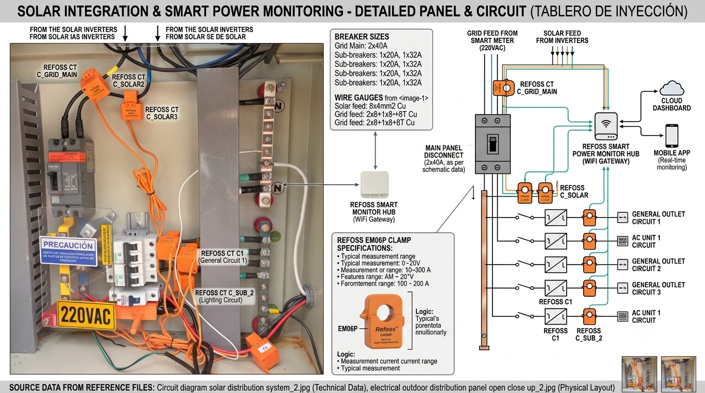

# ⚡ Solar Mining Cluster — Autonomous Bitcoin Mining with Solar Energy

> **Mine Bitcoin ONLY with solar surplus. Never import from the grid for mining.**

An ESP32-S3 monitors real-time energy via a Refoss EM06P 6-channel energy monitor and automatically scales SHA-256 mining operations (0-2001W, 16 profiles) to match available solar power.

## System Architecture


## Hardware (0-2001W, 0-104.5 TH/s)

| Device | Model | IP | Power |
|--------|-------|-----|-------|
| Controller | [LilyGO T-Display-S3](https://www.aliexpress.us/item/3256804310228562.html) | .26 | 2W |
| Energy Monitor | [Refoss EM06P](https://www.aliexpress.us/item/3256809503697509.html) | .82 | 2W |
| Relay Board | [ESP32 2CH Relay](https://www.aliexpress.us/item/3256804243304840.html) | .78 | 3W |
| BitAxe Gamma | [1.5 TH/s](https://www.aliexpress.us/item/3256808067170426.html) | .21 | 21W |
| NerdQAxe+ | [2.5 TH/s](https://www.aliexpress.us/item/3256808693446062.html) | .28 | 60W |
| Octaxe | [10.7 TH/s](https://www.aliexpress.us/item/3256808957009912.html) | .37 | 180W |
| Avalon Q | [52-90 TH/s](https://nhash.net/products/canaan-avalon-q-90th-1674w-bitcoin-btc-miner-free-shipping) | .51 | 800-1720W |

## Energy Monitoring


| Clamp | Channel | Measures | Formula |
|-------|---------|----------|---------|
| A1 | ch1 | Solar Phase A | **Solar = A1 + |B2|** |
| B2 | ch5 | Solar Phase B | |
| A2 | ch4 | Grid Phase A | **Grid = A2 + C2** |
| C2 | ch6 | Grid Phase B | (neg=export) |
| B1 | ch2 | House Phase B | **House = |B1| + |C1|** |
| C1 | ch3 | Shower | |

> Refoss EM06P reports **Active Power (W)**, not Apparent (VA). No PF multiplication needed.

## Mining Profiles


## Project Photos

| | |
|---|---|
|  |  |

## Diagrams

| | |
|---|---|
|  |  |
|  |  |
|  |  |

## Quick Start

1. Run `supabase_schema.sql` in Supabase SQL Editor
2. Upload `MinerControl_WebUI_FINAL/MinerControl_WebUI_FINAL.ino` to ESP32-S3
3. Open `http://192.168.1.26` in browser

## Documentation

| Document | Contents |
|----------|----------|
| [System Overview](documentation/SYSTEM_OVERVIEW.md) | Architecture, hardware, decision engine, parts list |
| [Setup & Config](documentation/SETUP_AND_CONFIG.md) | Arduino IDE, Tasmota relay boards, network, troubleshooting |
| [Database](documentation/DATABASE.md) | Supabase schema, tables, queries, views |
| [Web UI](documentation/WEB_UI.md) | Browser interface, API endpoints, auto-refresh |

## Key Files

```
MinerControl_WebUI_FINAL/MinerControl_WebUI_FINAL.ino  ← Main Arduino sketch
supabase_schema.sql                                     ← Database schema
diagrams/*.svg                                          ← Architecture diagrams
documentation/*.md                                      ← All documentation (4 files)
Miner_solar_cluster_imgs/                               ← Project photos
```

---
*Built with ESP32-S3, Refoss EM06P, Tasmota, and Supabase. Solar-only Bitcoin mining.* ⛏️☀️
