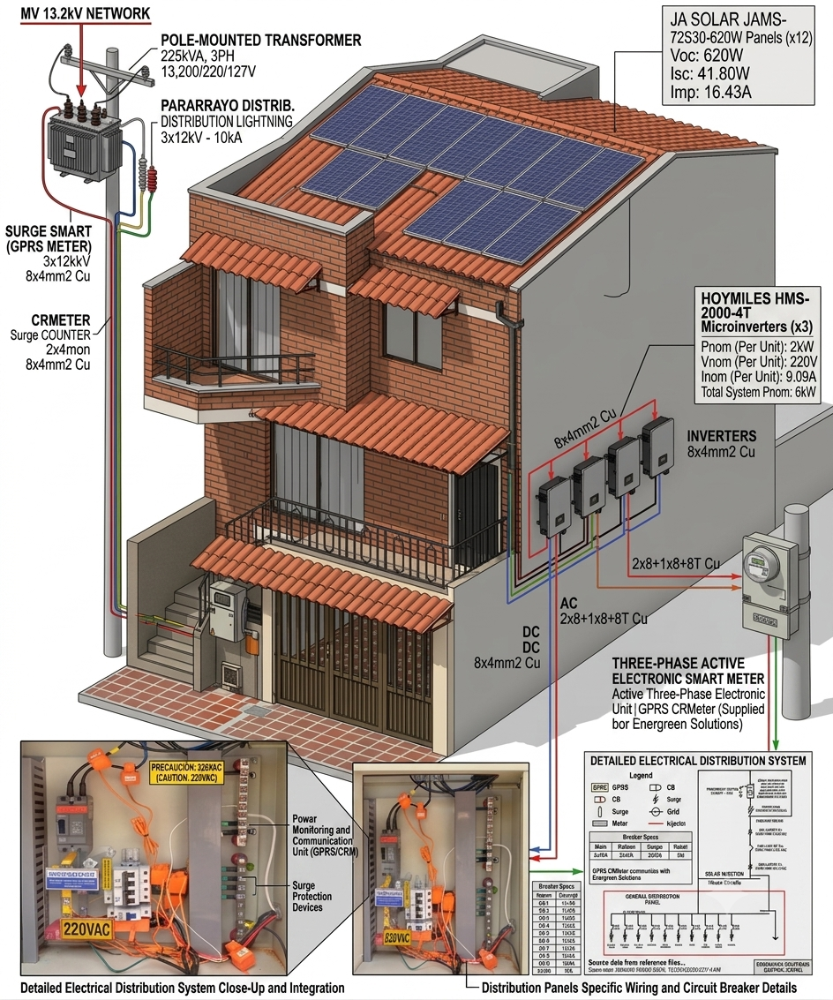
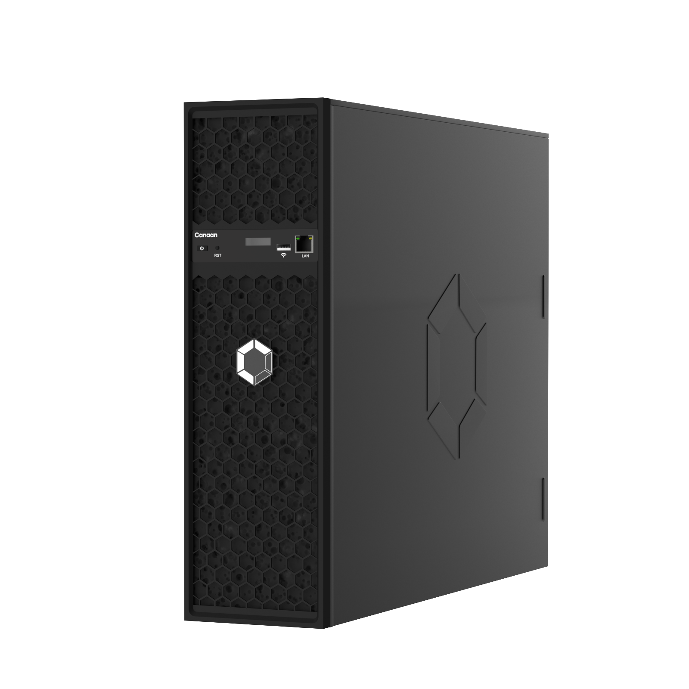
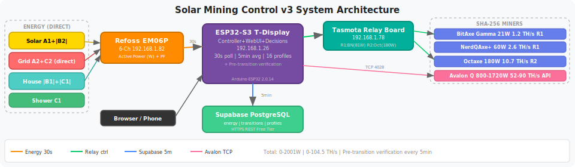
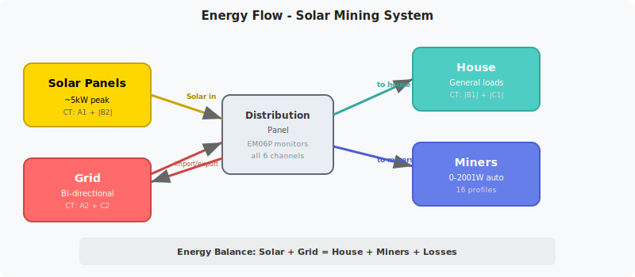
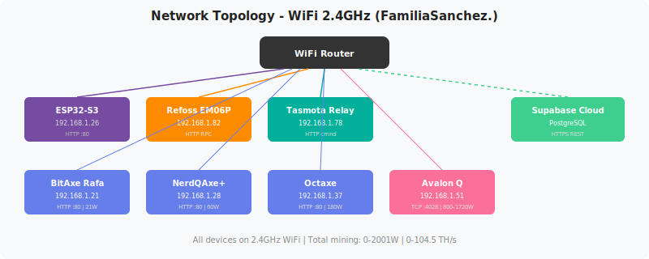
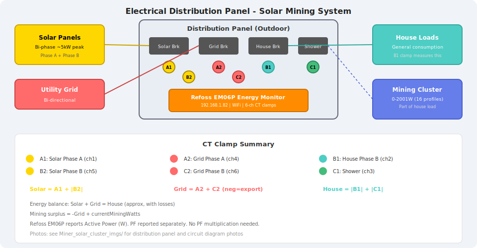
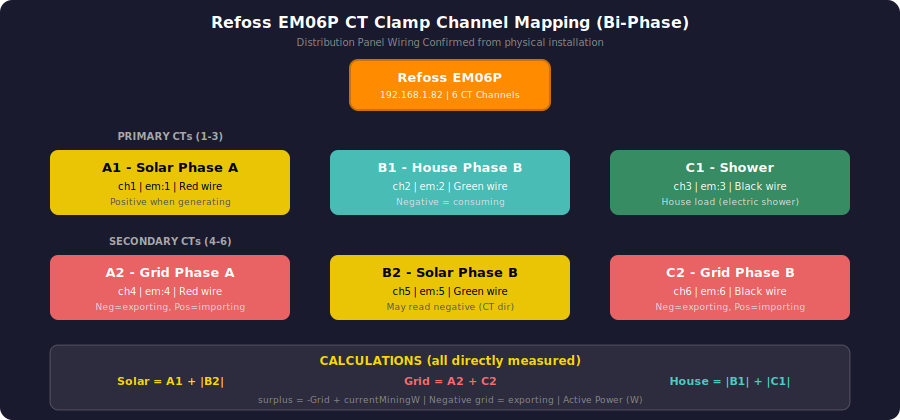
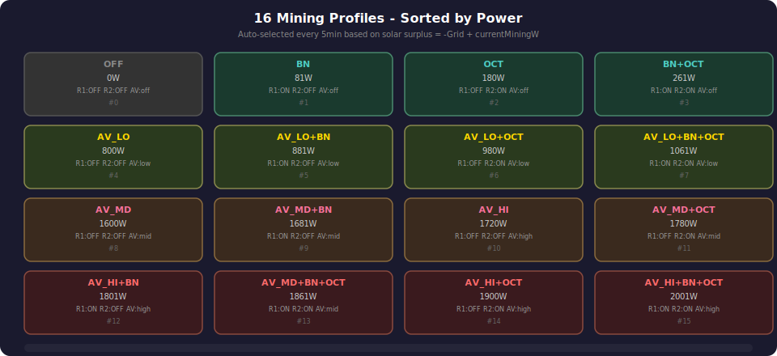

# ⚡ Solar Crypto Mining Farm — Autonomous Surplus Maximization Control

<p align="center">
  <strong>Mine Bitcoin ONLY with free solar energy. Zero grid consumption for mining. Ever.</strong>
</p>

<p align="center">
  
  
</p>


<p align="center">
  <a href="#-how-it-works">How It Works</a> •
  <a href="#-hardware">Hardware</a> •
  <a href="#%EF%B8%8F-solar-array">Solar Array</a> •
  <a href="#-mining-fleet">Mining Fleet</a> •
  <a href="#-energy-monitoring">Energy Monitoring</a> •
  <a href="#-quick-start">Quick Start</a> •
  <a href="#-documentation">Documentation</a>
</p>

---

## 🎯 What Is This?

A fully autonomous solar-powered Bitcoin mining system that dynamically scales hash power (0–2001W, 0–104.5 TH/s) to match real-time solar surplus. An ESP32-S3 microcontroller reads a 6-channel energy monitor every 30 seconds, calculates available solar power, and automatically switches between **16 mining profiles** — from a single 21W BitAxe to a full 2001W fleet including an Avalon Q at 90 TH/s.

**Key principle:** If the grid meter shows importing → scale down miners. If exporting → scale up. Never pay for electricity to mine.

---

## 🔄 How It Works

```
☀️ Solar Panels (7,740Wp)
        │
        ▼
🔌 3× Hoymiles HMS-2000-4T Microinverters (6,000W AC max)
        │
        ▼
📊 Distribution Panel ──── 6× CT Clamps ──── Refoss EM06P Energy Monitor
        │                                              │
        ├──▶ 🏠 House Loads                           │ HTTP API (every 30s)
        ├──▶ ⚡ Grid (bidirectional)                   │
        └──▶ ⛏️ Mining Cluster                         ▼
                    │                          🧠 ESP32-S3 Controller
                    │                                  │
                    ├── Relay R1 ──▶ BitAxe (21W) + NerdQAxe (60W)
                    ├── Relay R2 ──▶ Octaxe (180W)
                    └── API Only ──▶ Avalon Q (800-1720W)
```

Every **5 minutes**, the ESP32:
1. **Verifies** actual device states match expected (catches power outages/relay failures)
2. **Averages** all energy readings from the window
3. **Calculates** solar surplus: `surplus = -avgGrid + currentMiningWatts`
4. **Selects** the highest mining profile that fits under the surplus
5. **Executes** relay switches and Avalon Q API commands
6. **Logs** everything to Supabase cloud database

<p align="center">
  
</p>

---

## 🖥️ Dashboard

The ESP32-S3 serves a real-time web dashboard accessible from any browser on the local network:

| Feature | Description |
|---------|-------------|
| ☀️ Solar / ⚡ Grid / 🏠 Home | Live power readings with color-coded display |
| 6-Channel Detail | Individual CT clamp readings with power factor |
| Relay Controls | Manual ON/OFF for R1 (BitAxe+NerdQAxe) and R2 (Octaxe) |
| Miner Status | Hash rate, temperature, power for each miner |
| Avalon Q Controls | Sleep/Wake/Low/Mid/High mode + Reboot |
| Supabase Sync | Manual cloud sync + auto-push every 5 minutes |

### 🌐 Three.js 3D Mining Dashboard

A live interactive 3D visualization of the entire solar mining cluster is available at **[https://0xraphael.com/solar-mining-cluster](https://0xraphael.com/solar-mining-cluster)**. Built with Three.js, it renders the mining fleet, solar array, and energy flow in a fully navigable 3D scene.

<table>
<tr>
<td></td>
<td></td>
<td></td>
</tr>
<tr>
<td align="center"><em>Miner fleet 3D overview</em></td>
<td align="center"><em>Solar mining dashboard render</em></td>
<td align="center"><em>Antpool iframe integration</em></td>
</tr>
</table>

---

## 🔧 Hardware

### Control System

<table>
<tr>
<td width="120"></td>
<td><strong><a href="https://www.aliexpress.us/item/3256804310228562.html">LilyGO T-Display-S3 (ESP32-S3)</a></strong><br/>Main controller with 1.9" LCD display. Runs the web server, energy polling, decision engine, and Supabase sync. WiFi + Bluetooth 5.0, 16MB Flash, OPI PSRAM.</td>
<td align="right"><strong>2W</strong></td>
</tr>
<tr>
<td></td>
<td><strong><a href="https://www.aliexpress.us/item/3256809503697509.html">Refoss EM06P Energy Monitor</a></strong><br/>6-channel WiFi energy monitor with CT clamps. Reports active power (W), voltage (V), current (A), and power factor per channel. Shelly-compatible HTTP API.</td>
<td align="right"><strong>2W</strong></td>
</tr>
<tr>
<td></td>
<td><strong><a href="https://www.aliexpress.us/item/3256804243304840.html">ESP32-WROOM 2CH Relay Board</a></strong><br/>Tasmota-flashed relay board. R1 controls BitAxe+NerdQAxe (81W), R2 controls Octaxe (180W). 10A per relay, DC 5-60V input. HTTP command API.</td>
<td align="right"><strong>3W</strong></td>
</tr>
<tr>
<td></td>
<td><strong><a href="https://www.aliexpress.us/item/3256802365448988.html">ESP8266 2CH 30A Relay (Backup)</a></strong><br/>Backup relay board with 30A rating. ESP8266-based, Tasmota-flashed. Higher current capacity for future expansion.</td>
<td align="right"><strong>3W</strong></td>
</tr>
</table>

### Relay Board Installation

<table>
<tr>
<td></td>
<td></td>
</tr>
<tr>
<td align="center"><em>ESP32 2CH relay installed</em></td>
<td align="center"><em>All connections wired</em></td>
</tr>
</table>

---

## ⛏️ Mining Fleet

<table>
<tr>
<td width="120"></td>
<td><strong><a href="https://www.aliexpress.us/item/3256808067170426.html">BitAxe Gamma 601</a></strong><br/>Open-source Bitcoin miner. BM1366 ASIC, 1.5 TH/s, 21W measured. Connected via Relay R1.<br/><code>192.168.1.21</code></td>
<td align="right"><strong>21W<br/>1.5 TH/s</strong></td>
</tr>
<tr>
<td></td>
<td><strong><a href="https://www.aliexpress.us/item/3256808693446062.html">NerdQAxe+</a></strong><br/>2.5 TH/s Bitcoin miner, 60W. Shares Relay R1 with BitAxe (combined 81W).<br/><code>192.168.1.28</code></td>
<td align="right"><strong>60W<br/>2.5 TH/s</strong></td>
</tr>
<tr>
<td></td>
<td><strong><a href="https://www.aliexpress.us/item/3256808957009912.html">Nerd Octaxe</a></strong><br/>8-chip BM1370 board, 10.7 TH/s, 180W. Connected via Relay R2. Powered by 12V 100W PSU.<br/><code>192.168.1.37</code></td>
<td align="right"><strong>180W<br/>10.7 TH/s</strong></td>
</tr>
<tr>
<td></td>
<td><strong><a href="https://nhash.net/products/canaan-avalon-q-90th-1674w-bitcoin-btc-miner-free-shipping">Canaan Avalon Q</a></strong><br/>90 TH/s, 800-1720W, 3 power modes (Low/Mid/High). API-only control via CGMiner TCP:4028. No relay — uses software standby/wake commands.<br/><code>192.168.1.51:4028</code></td>
<td align="right"><strong>800-1720W<br/>52-90 TH/s</strong></td>
</tr>
</table>

### Mining Cluster Photos

<table>
<tr>
<td></td>
<td></td>
<td></td>
</tr>
<tr>
<td align="center"><em>Mining cluster front view</em></td>
<td align="center"><em>PSU connections</em></td>
<td align="center"><em>Upper view with wiring</em></td>
</tr>
</table>

<table>
<tr>
<td></td>
<td></td>
<td></td>
</tr>
<tr>
<td align="center"><em>Avalon Q 90TH/s</em></td>
<td align="center"><em>BitAxe Gamma</em></td>
<td align="center"><em>Nerd Octaxe</em></td>
</tr>
</table>

---

## ☀️ Solar Array

### 3× Hoymiles HMS-2000-4T Microinverters

12 solar panels, each 645W, connected one-per-MPPT-input across 3 microinverters.

<p align="center">
  
</p>

| Inverter | MPPT Inputs | Panels | Total Panel Power | AC Output Limit |
|----------|-------------|--------|-------------------|-----------------|
| **HMS-2000-4T #1** | I1M1, I1M2, I1M3, I1M4 | 4 × 645W | 2,580W | 2,000W |
| **HMS-2000-4T #2** | I2M1, I2M2, I2M3, I2M4 | 4 × 645W | 2,580W | 2,000W |
| **HMS-2000-4T #3** | I3M1, I3M2, I3M3, I3M4 | 4 × 645W | 2,580W | 2,000W |
| **TOTAL** | **12 MPPT inputs** | **12 panels** | **7,740Wp** | **6,000W AC** |

### Panel Specifications

| Parameter | Value |
|-----------|-------|
| Power per panel | **645W** |
| Voc (Open Circuit Voltage) | 58.3V |
| Isc (Short Circuit Current) | 15.21A |
| Imppt (Max Power Point Current) | 14.51A |
| Configuration | 1 panel per MPPT (1P/1S) |
| Total Peak DC Capacity | **7,740Wp** |
| Total AC Output (inverter limit) | **6,000W** |

> **Design Note:** Peak DC capacity (7,740W) intentionally exceeds inverter AC limit (6,000W) to provide headroom for partial shading, cloud cover, and non-ideal panel angles.

### House & Solar Installation

<table>
<tr>
<td></td>
</tr>
<tr>
<td align="center"><em>House with rooftop solar array</em></td>
</tr>
</table>

---

## 📊 Energy Monitoring

### Refoss EM06P — 6-Channel CT Clamp Setup

<table>
<tr>
<td></td>
<td></td>
<td></td>
</tr>
<tr>
<td align="center"><em>EM06P unboxed</em></td>
<td align="center"><em>CT clamps being crimped</em></td>
<td align="center"><em>Terminals crimped and ready</em></td>
</tr>
</table>

### CT Clamp Channel Mapping

The system uses a **bi-phase** electrical configuration. All three quantities (solar, grid, house) are **directly measured** — no estimation needed:

| Clamp | Refoss Channel | Wire Color | Measures | Formula |
|-------|---------------|------------|----------|---------|
| **A1** | ch1 / em:1 | — | ☀️ Solar Phase A | **Solar = \|A1\| + \|B2\|** |
| **B2** | ch5 / em:5 | Green | ☀️ Solar Phase B | |
| **A2** | ch4 / em:4 | Red | ⚡ Grid Phase A | **Grid = A2 + C2** |
| **C2** | ch6 / em:6 | Black | ⚡ Grid Phase B | (negative = exporting) |
| **B1** | ch2 / em:2 | — | 🏠 House Phase B | **House = \|B1\| + \|C1\|** |
| **C1** | ch3 / em:3 | — | 🚿 Shower | |

> **Important:** The Refoss EM06P `"power"` field reports **Active Power (W)**, not Apparent Power (VA). Power factor is reported separately. No additional PF multiplication is needed for the decision engine.

### Distribution Panel

<table>
<tr>
<td></td>
<td></td>
</tr>
<tr>
<td align="center"><em>Distribution panel close-up with CT clamps</em></td>
<td align="center"><em>Panel open view</em></td>
</tr>
</table>

<table>
<tr>
<td></td>
<td></td>
</tr>
<tr>
<td align="center"><em>Hand-drawn circuit diagram</em></td>
<td align="center"><em>Component item list</em></td>
</tr>
</table>

---

## 🎛️ The 16 Mining Profiles

The decision engine selects from 16 pre-calculated power profiles, sorted by total wattage:

| # | Profile | R1 (BN 81W) | R2 (Oct 180W) | Avalon Q | Total W | Total TH/s |
|---|---------|:-----------:|:-------------:|:--------:|--------:|----------:|
| 0 | OFF | ❌ | ❌ | off | **0** | 0 |
| 1 | BN | ✅ | ❌ | off | **81** | 4.0 |
| 2 | OCT | ❌ | ✅ | off | **180** | 10.7 |
| 3 | BN+OCT | ✅ | ✅ | off | **261** | 14.7 |
| 4 | AV_LO | ❌ | ❌ | low 800W | **800** | 52 |
| 5 | AV_LO+BN | ✅ | ❌ | low 800W | **881** | 56 |
| 6 | AV_LO+OCT | ❌ | ✅ | low 800W | **980** | 62.7 |
| 7 | AV_LO+BN+OCT | ✅ | ✅ | low 800W | **1061** | 66.7 |
| 8 | AV_MD | ❌ | ❌ | mid 1600W | **1600** | 75 |
| 9 | AV_MD+BN | ✅ | ❌ | mid 1600W | **1681** | 79 |
| 10 | AV_HI | ❌ | ❌ | high 1720W | **1720** | 90 |
| 11 | AV_MD+OCT | ❌ | ✅ | mid 1600W | **1780** | 85.7 |
| 12 | AV_HI+BN | ✅ | ❌ | high 1720W | **1801** | 94 |
| 13 | AV_MD+BN+OCT | ✅ | ✅ | mid 1600W | **1861** | 89.7 |
| 14 | AV_HI+OCT | ❌ | ✅ | high 1720W | **1900** | 100.7 |
| 15 | AV_HI+BN+OCT | ✅ | ✅ | high 1720W | **2001** | **104.7** |

### Example Day

```
 Time    Solar    Home    Grid      Surplus   Action
 06:00   0W       400W    +400W     0W        S0  OFF (no solar yet)
 08:00   200W     400W    +200W     200W      S2  Octaxe only (180W)
 10:00   1200W    500W    -700W     961W      S6  Avalon Low + Octaxe (980W)
 11:00   2000W    500W    -1500W    2480W     S15 ALL MAX (2001W) 🚀
 14:00   1000W    500W    -500W     1220W     S7  Avalon Low + All Small (1061W)
 17:00   300W     600W    +300W     300W      S3  BitAxe + NerdQAxe + Octaxe (261W)
 19:00   0W       600W    +600W     0W        S0  OFF (sunset)
```

---

## 🔌 Power Supplies

<table>
<tr>
<td></td>
<td></td>
<td></td>
</tr>
<tr>
<td align="center"><em>5V/12V PSU for BitAxe & NerdQAxe</em></td>
<td align="center"><em><a href="https://www.aliexpress.us/item/3256807208787904.html">12V 100W PSU</a> for Octaxe</em></td>
<td align="center"><em><a href="https://www.aliexpress.us/item/3256808314505260.html">5V 2A USB Charger</a> for ESP32</em></td>
</tr>
</table>

---

## 🛡️ Power Outage Recovery

The system includes automatic state verification before every transition. After a power outage or relay failure:

1. ESP32-S3 checks actual Tasmota relay states vs. expected states
2. Pings Avalon Q TCP port to verify it's reachable
3. If **any mismatch** is detected:
   - Force-corrects all relays and Avalon Q to match expected profile
   - Logs a **correction transition** to Supabase (identified by `old_id == new_id`)
4. Only THEN proceeds with the normal surplus-based decision

This prevents scenarios like the Avalon Q turning back on after a power outage when it should remain off.

---

## 🛠️ Tools & Wiring Accessories

<table>
<tr>
<td></td>
<td></td>
<td></td>
</tr>
<tr>
<td align="center"><em><a href="https://www.aliexpress.us/item/3256810332001270.html">Wire Crimping Kit</a></em></td>
<td align="center"><em><a href="https://www.aliexpress.us/item/3256806062864141.html">O-type Terminal Lugs</a></em></td>
<td align="center"><em><a href="https://www.aliexpress.us/item/3256806910315665.html">USB-TTL Adapters</a> (PL2303/CP2102/CH340G)</em></td>
</tr>
</table>

<table>
<tr>
<td></td>
<td></td>
<td></td>
</tr>
<tr>
<td align="center"><em><a href="https://www.aliexpress.us/item/3256808741160255.html">Wire Stripper Pliers</a></em></td>
<td align="center"><em><a href="https://www.aliexpress.us/item/3256807032671463.html">LAOA Cable Cutting Pliers</a></em></td>
<td align="center"><em><a href="https://www.aliexpress.us/item/3256805281155490.html">Cooling Fan Guards</a></em></td>
</tr>
</table>

> 📸 **[View all 60+ project photos →](Miner_solar_cluster_imgs/README.md)**

---

## 🚀 Quick Start

### Prerequisites
- Arduino IDE with ESP32 board support (version **2.0.14**, NOT 3.0+)
- Arduino_GFX library **v1.3.7**
- A Supabase account (free tier works)

### Setup Steps

1. **Database:** Run `supabase_schema.sql` in [Supabase SQL Editor](https://supabase.com/dashboard)
2. **Credentials:** Copy `MinerControl_WebUI_FINAL/credentials.h.example` → `credentials.h` and fill in your WiFi, Tasmota, Supabase, and Refoss passwords
3. **Upload:** Flash `MinerControl_WebUI_FINAL/MinerControl_WebUI_FINAL.ino` to ESP32-S3
4. **Access:** Open `http://192.168.1.26` in your browser
5. **Auto-pilot:** System auto-discovers Refoss, starts polling energy data, and begins autonomous mining decisions after 5 minutes

---

## 📚 Documentation

| Document | Contents |
|----------|----------|
| [📐 System Overview](documentation/SYSTEM_OVERVIEW.md) | Architecture, hardware specs, decision engine, all 16 mining profiles, solar array details, complete parts list with AliExpress links |
| [🔧 Setup & Config](documentation/SETUP_AND_CONFIG.md) | Arduino IDE setup, board settings, Tasmota relay configuration (both ESP32 and ESP8266 boards), network config, troubleshooting |
| [💾 Database](documentation/DATABASE.md) | Supabase schema, energy & transitions tables, audit queries, dashboard views |
| [🖥️ Web UI](documentation/WEB_UI.md) | Browser interface layout, API endpoints, auto-refresh intervals |
| [📋 Tasmota ESP32 Relay Setup](documentation/TASMOTA_ESP32_2X_RELAY_SETUP.md) | Complete GPIO mapping, configuration, HTTP API for the active ESP32 relay board |
| [📋 Tasmota ESP12F Relay Setup](documentation/TASMOTA_ESP12F_2CH_SETUP.md) | Complete setup for the backup 30A ESP8266 relay board |
| [🌐 3D Mining Dashboard](https://0xraphael.com/solar-mining-cluster) | Interactive Three.js 3D visualization of the solar mining cluster, miner fleet, and energy flow |

---

## 📁 Project Structure

```
├── MinerControl_WebUI_FINAL/
│   ├── MinerControl_WebUI_FINAL.ino    ← Main Arduino sketch (1500+ lines)
│   ├── credentials.h.example           ← Template for credentials (copy → credentials.h)
│   └── credentials.h                   ← Your real credentials (gitignored)
├── documentation/
│   ├── SYSTEM_OVERVIEW.md              ← Architecture + hardware + decision engine
│   ├── SETUP_AND_CONFIG.md             ← Arduino IDE + Tasmota + network setup
│   ├── DATABASE.md                     ← Supabase schema + queries
│   └── WEB_UI.md                       ← Dashboard interface + API
├── diagrams/                           ← 10 SVG architecture diagrams
├── Miner_solar_cluster_imgs/           ← 60+ project photos
│   └── dashboard_pngs/                 ← Miner product images
├── documentation/
│   ├── TASMOTA_ESP32_2X_RELAY_SETUP.md ← Active relay board documentation
│   └── TASMOTA_ESP12F_2CH_SETUP.md     ← Backup relay board documentation
├── supabase_schema.sql                 ← Database schema
├── .gitignore                          ← Excludes credentials.h, .env
└── README.md                           ← This file
```

---

## 📦 Complete Bill of Materials

### Mining Hardware

| Component | Specs | Power | Link |
|-----------|-------|-------|------|
| Canaan Avalon Q | 90 TH/s SHA-256 | 800/1600/1720W | [NHASH](https://nhash.net/products/canaan-avalon-q-90th-1674w-bitcoin-btc-miner-free-shipping) |
| BitAxe Gamma 601 | 1.5 TH/s BM1366 | 25W (21W actual) | [AliExpress](https://www.aliexpress.us/item/3256808067170426.html) |
| NerdQAxe+ | 2.5 TH/s | 60W | [AliExpress](https://www.aliexpress.us/item/3256808693446062.html) |
| Nerd Octaxe | 8-chip BM1370, 10.7 TH/s | 180W | [AliExpress](https://www.aliexpress.us/item/3256808957009912.html) |

### Control & Monitoring

| Component | Role | Link |
|-----------|------|------|
| LilyGO T-Display-S3 | Main controller + LCD | [AliExpress](https://www.aliexpress.us/item/3256804310228562.html) |
| Refoss EM06P | 6-channel energy monitor | [AliExpress](https://www.aliexpress.us/item/3256809503697509.html) |
| ESP32-WROOM 2CH Relay | Active Tasmota relay board | [AliExpress](https://www.aliexpress.us/item/3256804243304840.html) |
| ESP8266 2CH 30A Relay | Backup relay board | [AliExpress](https://www.aliexpress.us/item/3256802365448988.html) |
| USB-TTL Adapters (3-pack) | PL2303/CP2102/CH340G | [AliExpress](https://www.aliexpress.us/item/3256806910315665.html) |

### Power Supplies

| Component | Output | Link |
|-----------|--------|------|
| DC 12V Switching PSU 100W | Powers Octaxe | [AliExpress](https://www.aliexpress.us/item/3256807208787904.html) |
| 5V/12V Dual PSU | Powers BitAxe + NerdQAxe | — |
| USB Wall Charger 5V 2A | Powers ESP32 controller | [AliExpress](https://www.aliexpress.us/item/3256808314505260.html) |

### Tools & Wiring

| Component | Purpose | Link |
|-----------|---------|------|
| O-type Terminal Lugs (150pc) | CT clamp wire termination | [AliExpress](https://www.aliexpress.us/item/3256806062864141.html) |
| Wire Crimping Kit AWG 23-13 | Crimping connectors | [AliExpress](https://www.aliexpress.us/item/3256810332001270.html) |
| Wire Stripping Pliers | Wire preparation | [AliExpress](https://www.aliexpress.us/item/3256808741160255.html) |
| LAOA Wire Stripping Pliers | Professional grade | [AliExpress](https://www.aliexpress.us/item/3256807032671463.html) |
| Cooling Fan Guards | Miner ventilation | [AliExpress](https://www.aliexpress.us/item/3256805281155490.html) |
| Screw Set M3-6 | Mounting hardware | [AliExpress](https://www.aliexpress.us/item/3256807755286435.html) |

### Solar Infrastructure

| Component | Specs |
|-----------|-------|
| Solar Panels × 12 | 645W each, Voc 58.3V, Isc 15.21A |
| Hoymiles HMS-2000-4T × 3 | 4-MPPT microinverters, 2000W AC each |

---

## 🏗️ Architecture Diagrams

<table>
<tr>
<td></td>
<td></td>
</tr>
<tr>
<td align="center"><em>System Architecture</em></td>
<td align="center"><em>Energy Flow</em></td>
</tr>
<tr>
<td></td>
<td></td>
</tr>
<tr>
<td align="center"><em>Network Topology</em></td>
<td align="center"><em>Electrical Distribution</em></td>
</tr>
<tr>
<td></td>
<td></td>
</tr>
<tr>
<td align="center"><em>CT Clamp Channel Mapping</em></td>
<td align="center"><em>Mining Profiles</em></td>
</tr>
</table>

---

## 🔐 Security

- **`credentials.h`** (real passwords) is **gitignored** — never committed
- **`credentials.h.example`** (placeholders) is committed as a template
- **`.env`** (API keys) is **gitignored**
- All documentation uses placeholder values like `YOUR_WIFI_PASSWORD`
- The `.ino` file uses `#include "credentials.h"` — no hardcoded secrets

---

## 📄 License

Open source. Built for the Bitcoin mining community. ⛏️☀️

---

<p align="center">
  <strong>Solar-powered. Autonomous. Profitable.</strong><br/>
  <em>Built with ESP32-S3, Refoss EM06P, Tasmota, Supabase, and 12 solar panels.</em>
</p>
